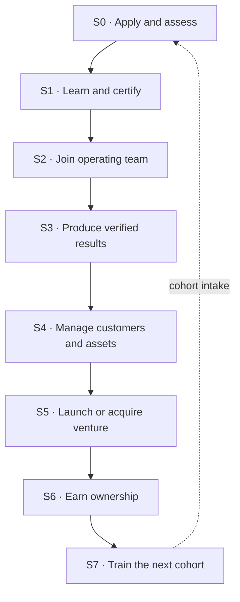

# West African Mobility Venture Foundry — Constitution v1.0

**Status:** `PROPOSAL`
**Date:** 6 September 2026
**Prepared for:** Major Dream Williams
**Governs:** the founder-development, venture-formation, shared-services, and ownership layer of the West African Mobility OS
**Subordinate to:** [`VISION.md`](./VISION.md) and [`Mauritania_Mobility_Intelligence_Canonical_Package/AGENTS.md`](./Mauritania_Mobility_Intelligence_Canonical_Package/AGENTS.md)

---

## 0. Status declaration

This document describes a **proposed operating model**. Nothing in it constitutes an offer of equity, employment, partnership, franchise, licence, security, credit, or territory to any person. No participant acquires any right by reading it, by being named in it, by joining a cohort, or by completing any stage described in it.

Every ownership pathway in Section 7 is a `PROPOSAL` until a specific, executed, jurisdiction-appropriate legal instrument exists between named parties. The evidence classifications in `AGENTS.md` (`VERIFIED` / `REPORTED` / `ASSUMPTION` / `PROPOSAL` / `OPEN` / `CONFLICT`) apply to this document with full force.

---

## 1. Why a foundry and not an academy

An academy produces trained people who then look for employers. An accelerator produces founders who then look for a market. Neither fits the corridor problem.

The corridor's constraint is not talent and not ideas. It is **infrastructure that individually-owned businesses cannot afford to build alone**: diagnostics, parts supply, evidence systems, warranty administration, customer records, credential verification, working capital, and quality standards. A mechanic in Nouakchott does not fail for lack of skill. They fail because the tooling, parts pipeline, financing, and customer trust that make skill scale do not exist around them.

A **venture foundry** is the structure that answers that constraint. It:

1. Teaches technical and business capability (the academy function).
2. Places people inside real operating teams serving real customers (the operating function).
3. Records verified performance over time (the evidence function).
4. Supplies shared technology, procurement, standards, and back-office to every venture it spawns (the platform function).
5. Converts verified performance into a pathway toward business ownership (the ownership function).

The foundry's product is not a graduate. It is **an operating African-owned business with a customer base, an evidence record, and an owner who earned it.**

> The platform creates opportunity and infrastructure.
> Ownership is earned through verified contribution, responsibility, risk, and results.

---

## 2. The four systems

| System | Function | Primary artifact |
|---|---|---|
| **Technical academy** | Mechanics, diagnostics, EV and hybrid systems, business operations, digital literacy | Verified credential record |
| **Venture foundry** | Converts qualified participants into founders and operating partners | Venture charter + stage-gate record |
| **Shared operating platform (HAMAL)** | CRM, procurement, evidence, finance, fleet, service, credential infrastructure | Tenant workspace + data-rights agreement |
| **Commercial corridor** | Customers, vehicles, institutional relationships, expansion markets | Demand contracts + country nodes |

The complete foundry model may not be represented as operationally ready until all four systems are connected at the minimum level required by the applicable stage gate. Individual components may be researched, built, and tested during Phase 0. An academy without a path into the corridor risks producing unemployed certificates. A corridor without the academy risks imported labour. A foundry without the platform makes founders rebuild the same back office. A platform without governance risks extraction.

---

## 3. Constitutional commitments

These are proposed constitutional commitments. They become binding only when adopted through a recorded governance decision and, where required, implemented through appropriate legal instruments. Until then, they are mandatory design constraints for work produced from this repository and may not be represented as executed legal rights or obligations.

### 3.1 Ownership is earned, never granted by proximity
Introductions, group-chat access, early presence, family relationship, cohort attendance, or verbal encouragement create **no** economic claim. Section 7 defines the only routes.

### 3.2 The participant owns their record
A participant has rights of access, correction, consent, and portability over their credential, training, performance, and contribution records, subject to applicable law and legitimate safety, warranty, employment, and audit obligations. Venture customer relationships are governed separately under Section 3.3 and are not transferred to a participant merely because the participant serviced that customer. See [`DATA-RIGHTS-POLICY.md`](./docs/foundry/DATA-RIGHTS-POLICY.md).

### 3.3 The venture owns its customers
HAMAL is infrastructure, not an intermediary that captures the customer relationship. A venture's customer records are the venture's. The platform's rights are limited, enumerated, revocable, and consented to in writing.

### 3.4 Consent precedes collection
No technician, workshop, customer, or vehicle owner enters the data layer without informed, revocable, language-appropriate consent. Coverage is never a defence for collection without consent.

### 3.5 The gate is a human decision
Agents, scorecards, and rubrics raise gates. They do not pass them. Every stage transition in the founder lifecycle and every venture stage gate requires a named human decision-maker, recorded with date and rationale.

### 3.6 Evidence discipline is not suspended for people
The same classification rules that govern a landed-cost claim govern a claim about a participant's performance. "Diallo is ready to operate" is a claim requiring a source, a classification, and a validation owner — exactly like "the statistical fee is 1%."

### 3.7 Failure is published
Failures are reported with the same discipline and cadence as successes. The `anti-extraction-audit` publishes aggregate governance results, including poor results, subject to privacy, safety, legal, security, and legitimate commercial-confidentiality controls. Those controls may protect people and sensitive records; they may not be used to conceal programme performance.

### 3.8 No lane merging
Marine Foundation's education lane, the commercial corridor's trading lane, the country operating companies, and the asset SPVs remain separately governed. The foundry may coordinate across them. It may not collapse them. Automotive, gold, and smart-city opportunities stay in separate commercial and compliance lanes.

### 3.9 Local capability over local labour
Every foreign input — Chinese product, technology, finance, training, expertise — is measured by one question: does it increase the corridor's ability to operate without it? An input that deepens dependency is a cost, not an accelerant, whatever its price.

### 3.10 Nothing binding without an entity
No deposits, no equity, no franchise fees, no participant payments, and no revenue-share obligations exist until a confirmed legal entity, payment custody, contract, refund policy, and risk allocation are in place and approved.

---

## 4. The participant pathway

A person entering as a mechanic is not "a mechanic we trained." Depending on capability and choice, the same pathway produces mobile-service founders, diagnostic-centre operators, workshop owners, parts-distribution partners, fleet-maintenance contractors, roadside-assistance operators, technical instructors, regional quality-assurance leaders, certified-used-vehicle inspectors, and country technical directors.

The pathway is identical in structure — and deliberately differently supported — for women, young people, diaspora participants, sales agents, logistics operators, developers, and participants with caregiving constraints. See [`FIRST-COHORT-DESIGN.md`](./docs/foundry/FIRST-COHORT-DESIGN.md) §4.

Full definition, entry and exit evidence per stage, and promotion authority: [`FOUNDER-LIFECYCLE.md`](./docs/foundry/FOUNDER-LIFECYCLE.md).

---

## 5. Venture formation

Ventures move through six stages — `V0 Signal` → `V1 Thesis` → `V2 Design` → `V3 Build` → `V4 Pilot` → `V5 Operate` — with a hard gate between each. Gates test demand evidence, unit economics, operating readiness, governance, data rights, and the founder's verified record. A venture may be held, redirected, merged, or stopped at any gate.

Twenty initial venture tracks are catalogued in [`VENTURE-TRACK-CATALOG.md`](./docs/foundry/VENTURE-TRACK-CATALOG.md), each with its shared-service dependencies, capital shape, and the specific gate that most commonly kills it.

Full gate definitions and required artifacts: [`VENTURE-STAGE-GATES.md`](./docs/foundry/VENTURE-STAGE-GATES.md).

---

## 6. The embedded HAMAL layer

Every venture receives a ready-made operating layer rather than rebuilding one: identity and permissions, company workspace, customer CRM, supplier records, vehicle and VIN records, service history, parts catalogue, technician credentials, training records, evidence and claims, pricing and landed-cost tools, work orders, fleet uptime, quality metrics, and — later, subject to Section 3.10 — payments, financing records, governance, and audit history.

One serviced vehicle updates vehicle history, technician experience, workshop performance, parts consumption, warranty status, first-time-fix rate, fleet downtime, customer satisfaction, and technician ownership progress from a single event. That compounding is the corridor's real asset.

**It is only an asset if it is consensual and governed.** HAMAL exists to enable local enterprises, not to surveil them or capture their customer relationships. The rights the platform holds are enumerated in [`DATA-RIGHTS-POLICY.md`](./docs/foundry/DATA-RIGHTS-POLICY.md); anything not enumerated there is not granted.

Service catalogue, tenancy model, and integration contracts: [`SHARED-SERVICES-ARCHITECTURE.md`](./docs/foundry/SHARED-SERVICES-ARCHITECTURE.md).

---

## 7. The ownership model

No predetermined equity percentages are promised. Ownership attaches to measurable contribution, recorded in the contribution ledger: training completed, customers acquired, revenue generated, assets managed, capital contributed, risk accepted, service quality, governance performance, local team developed, intellectual property created, and demonstrated ability to train successors.

Ten pathways are recognised, each with a distinct risk and control profile: founder-owned businesses licensed onto the platform, country operating-company participation, revenue-sharing service cells, earned equity, management buy-ins, franchised operating units, cooperative ownership, driver-to-owner assets, workshop-to-owner finance, and venture SPVs.

Ledger schema, vesting logic, dilution rules, exit and forfeiture terms, and the prohibition on informal allocation: [`OWNERSHIP-AND-EARNED-EQUITY.md`](./docs/foundry/OWNERSHIP-AND-EARNED-EQUITY.md).

---

## 8. The operating workflow

The foundry runs an opinionated agent workflow rather than an open chat. A founder entering the foundry does not begin with an empty prompt; they enter a structured process with specialist agents, templates, tests, operating standards, and real corridor data.

`Think → Plan → Build → Review → Test → Ship → Reflect`, with each stage producing artifacts the next stage consumes — adapted from the G-Stack pattern, executed by MobStack, governed by HAMAL doctrine. This is our own system: influenced by others, built on our own technology, guidance, and agents.

Four layers, coordinated and distinct — the same words in all four repositories:

- **MAIM** develops the person: confidence, context, direction, experimentation, AI literacy, builder mindset.
- **HAMAL** develops and coordinates the operating system: context, agents, skills, tools, playbooks, rubrics, MOBS.
- **MobStack** runs the approved HAMAL workflows, applies the gates, and emits receipts.
- **This Industry OS** applies them to the automotive corridor and owns mobility facts.

Authority flows downward. Field evidence flows upward as reviewed proposals only. This repository never silently redefines universal doctrine.

Role mapping, artifact contracts, MOB assignment, and the Claude Cowork / Claude Code / Codex / AI Studio interface: [`FOUNDRY-AGENT-WORKFLOW.md`](./docs/foundry/FOUNDRY-AGENT-WORKFLOW.md).

---

## 9. Geography and replication

- **Mauritania** — first founder-development node. Controlled market entry, evidence sprint, workshop registry, first operating cells.
- **Senegal** — proposed training, service, parts, and quality-assurance accelerator. The first action remains the investigation required by `DEC-016`; no taxi demonstration or accelerator status is treated as approved before that evidence is recorded.
- **West Africa** — replication horizon. Each node passes its own legal, demand, service, governance, and capital gates. No node inherits another's authorisation.

Once mobility works as a foundry industry, its proven general patterns may be proposed upstream for adaptation to energy, logistics, construction, agriculture, mining services, housing, and smart-city infrastructure. **Mobility is the first industry, not the only one.** Mobility-specific rules remain valid here; only patterns demonstrated to be reusable should become universal HAMAL doctrine.

---

## 10. The endgame

Not:

> We trained 5,000 people to work around imported vehicles.

But:

> We used mobility as the first industry to develop thousands of African technicians, founders, asset owners, operators, trainers, and investors — supported by shared technology and capable of building the next generation of African companies.

---

## 11. Amendment

This constitution is amended only by a recorded decision in [`DECISION-REGISTER.md`](./Mauritania_Mobility_Intelligence_Canonical_Package/docs/00-governance/DECISION-REGISTER.md), naming the decision-maker, the date, the superseded text, and the rationale. Superseded text is preserved as historical truth and never silently overwritten. Where this document conflicts with `AGENTS.md` or `SOURCE-OF-TRUTH.md`, those documents win.

---

## Document map

| Document | Answers |
|---|---|
| [`FOUNDER-LIFECYCLE.md`](./docs/foundry/FOUNDER-LIFECYCLE.md) | How does a person move from applicant to owner? |
| [`VENTURE-STAGE-GATES.md`](./docs/foundry/VENTURE-STAGE-GATES.md) | How does an idea become an operating business? |
| [`SHARED-SERVICES-ARCHITECTURE.md`](./docs/foundry/SHARED-SERVICES-ARCHITECTURE.md) | What does every venture get for free, and on what terms? |
| [`DATA-RIGHTS-POLICY.md`](./docs/foundry/DATA-RIGHTS-POLICY.md) | Who owns what data, and what may the platform do with it? |
| [`FIRST-COHORT-DESIGN.md`](./docs/foundry/FIRST-COHORT-DESIGN.md) | What exactly happens in Cohort 001? |
| [`VENTURE-TRACK-CATALOG.md`](./docs/foundry/VENTURE-TRACK-CATALOG.md) | Which businesses can the foundry produce? |
| [`OWNERSHIP-AND-EARNED-EQUITY.md`](./docs/foundry/OWNERSHIP-AND-EARNED-EQUITY.md) | How is ownership measured, vested, and lost? |
| [`FOUNDRY-AGENT-WORKFLOW.md`](./docs/foundry/FOUNDRY-AGENT-WORKFLOW.md) | How do the agents actually run this? |

*Prepared under the evidence discipline in `AGENTS.md`. Every named pathway is a `PROPOSAL` until an executed instrument exists.*
