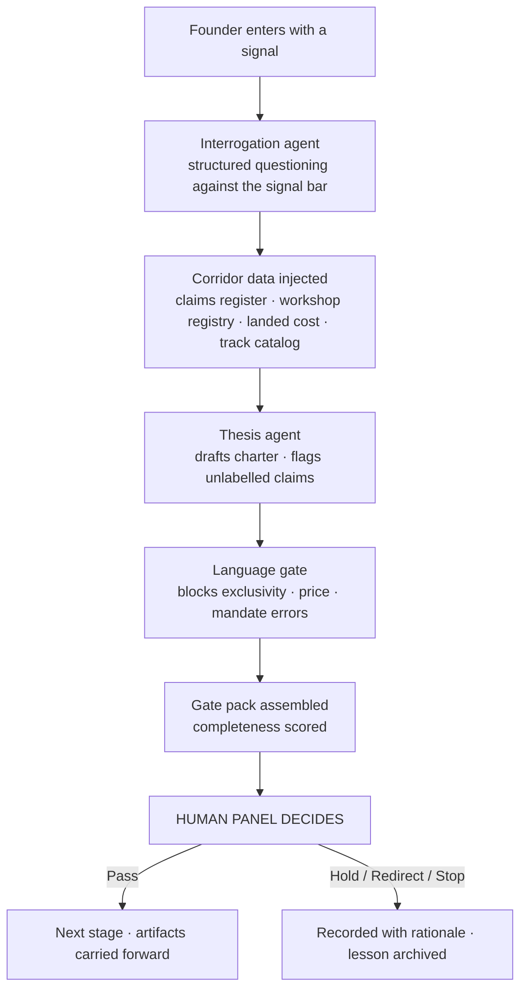

# Foundry Agent Workflow

**Status:** `PROPOSAL`
**Parent:** [`MOBILITY-VENTURE-FOUNDRY.md`](../../MOBILITY-VENTURE-FOUNDRY.md) §8
**Interfaces:** HAMAL_MOB_PLAYBOOKS (doctrine) · MobStack (rails) · Major-AI-OS (system core) · this repository (corridor truth)

---

## What we are adapting, and what we are not

The G-Stack pattern is useful for one specific reason: it treats AI as an **opinionated operating team** rather than a blank chatbot. Work moves `Think → Plan → Build → Review → Test → Ship → Reflect`, with specialist roles — founder review, engineering planning, design review, QA, security, release, investigation, retrospective — and **each stage produces artifacts the next stage consumes**.

That operating pattern is what we adapt. Its software is not.

What we build instead is ours: MobStack rails, HAMAL doctrine, corridor evidence discipline, and the Major AI Mindset layer. Influenced by others; built on our own technology, guidance, and agents.

**The Major AI Mindset contribution is the decisive one.** A skill is a documented method. A playbook decides *why, when, with what tools, in what order, for what outcome, and how quality is judged*. G-Stack gives us a stage sequence. HAMAL gives us the doctrine that makes each stage produce business value rather than output. Without that layer, a foundry agent workflow is a very well-organised way to generate documents nobody uses.

---

## Stage mapping

| G-Stack pattern | Foundry adaptation | Produces | Consumed by |
|---|---|---|---|
| Office Hours | **Founder and opportunity interrogation** | Signal note, founder record extract | V1 thesis |
| CEO Review | **Venture thesis and ownership review** | Venture charter, ownership pathway proposal | G2 panel |
| Engineering Review | **Operations, data, and technical architecture** | Operating design, shared-services plan, data-rights draft | G3 panel |
| Design Review | **Customer journey and local-market review** | Journey map, language and access review, inclusion check | G3 panel |
| Security Review | **Evidence, privacy, financial, and relationship audit** | Risk register, consent design, lane check, language-gate pass | G3 panel |
| Build | **Controlled business or product experiment** | Operating cell, SOPs, credentialed crew, live tenant | G4 panel |
| QA | **Field validation with real customers** | Work-order evidence, quality metrics, defect log | G4 panel |
| Ship | **Limited commercial pilot** | Pilot charter with stop-loss, live customers | G5 panel |
| Canary | **Small fleet, workshop, or geography test** | Bounded pilot results, realised unit economics | G5 panel |
| Review | **Performance and governance audit** | Scorecard contribution, governance findings | Quarterly review |
| Retrospective | **Cohort learning and playbook improvement** | Lessons, playbook deltas, curriculum changes | Next cohort |
| Documentation | **Country replication package** | Node playbook, localised sprint, evidence bar | `country-envoy-onboarding` |

**The artifact chain is the mechanism.** A stage that produces no artifact the next stage consumes is theatre. If a review cannot name what it hands forward, it should not be run.

---

## The founder's actual experience

A founder entering the foundry does not open an empty chat. They enter:

The founder gets specialist agents, templates, tests, operating standards, and **real corridor data** — not generic startup advice. That is the difference between a foundry and a prompt library.

---

## Agent roster

### Inherited gates (already specified, unchanged)
`corridor-language-gate` and `corridor-evidence-clerk` run across every stage of this workflow. Nothing leaves any stage without passing the language gate; nothing enters the record without the evidence clerk. See [`HAMAL-AGENT-SKILL-ARCHITECTURE.md`](../../Mauritania_Mobility_Intelligence_Canonical_Package/docs/06-agents/HAMAL-AGENT-SKILL-ARCHITECTURE.md).

### Foundry additions

| Skill | Stage | Does | Never does |
|---|---|---|---|
| `founder-interrogator` | Office Hours | Structured questioning of signal and founder readiness against the published bar; separates observation from assertion | Judge the person |
| `venture-gate-assembler` | All gates | Assembles the pack, scores artifact completeness, flags unlabelled claims and missing sources | Vote, or score the decision |
| `founder-ledger-clerk` | Continuous | Maintains the contribution ledger; refuses unsourced entries; reconciles before any S6 instrument | Create ownership |
| `cohort-inclusion-monitor` | Continuous | Tracks and publishes coverage gaps by gender, age, geography, access, disability | Set quotas silently |
| `data-rights-auditor` | Engineering + Security review | Verifies consent basis for every derived use; blocks cross-tenant reads outside the four mechanisms | Grant an exception |
| `pilot-canary-watch` | Canary | Monitors pilot metrics against the pre-set stop-loss; raises when a bound is crossed | Stop the pilot itself |
| `retro-compiler` | Retrospective | Compiles cohort lessons into playbook and curriculum deltas | Decide what changes |

**Every skill's "never" column is load-bearing.** Agents enforce discipline, structure evidence, and prevent language errors. Every gate they raise is a prompt for a human judgement, not a substitute for one.

---

## MOB assignment

Mapping the foundry's work onto the twelve MOBS in the MobStack doctrine, so no output is an orphan and no agent is without a Mob:

| MOB | Foundry ownership |
|---|---|
| **Maestros** | Workflow orchestration, gate scheduling, artifact routing, HAMAL sync |
| **Artisans** | Quality metrics, benchmarks, corridor scorecard, landed-cost modelling |
| **Visionaries** | Corridor thesis, node sequencing, industry portability beyond mobility |
| **Strategists** | Venture tracks, demand evidence, pricing, market expansion |
| **Vanguards** | Data rights, consent, security, permissions, the language gate |
| **Guardians** | Public trust, disclosure discipline, incident and crisis response |
| **Provocateurs** | Cohort recruitment, corridor visibility, demand aggregation |
| **Dreamweavers** | Narrative, local content, founder storytelling, brand |
| **Innovators** | Product, diagnostics tooling, prototypes, platform features |
| **Revolutionaries** | Structural change — ownership models, driver-to-owner, cooperative forms |
| **Luminaries** | Curriculum, mentorship, train-the-trainer, S7 succession |
| **Avant-Garde** | EV and energy transition signals, regional and technology frontier |

---

## Repository interface

Four repositories, four distinct jobs. Keeping them distinct is what prevents doctrine drift.

| Repository | Owns | Must not own |
|---|---|---|
| **West-African-mobility-OS** (this repo) | Corridor truth: constitution, claims, evidence, gates, cohort design, country nodes | Generic agent runtime |
| **HAMAL_MOB_PLAYBOOKS** | Doctrine: playbooks, SOPs, rubrics, Mob operating models, agent context rules, the Major AI Mindset layer | Corridor-specific claims |
| **Mobstack** | Rails: agent schemas, repo ingestion, orchestration, sub-agent spawning, memory sync, test harnesses | Doctrine or corridor facts |
| **Major-AI-OS** | System core: stack definition, operating law, execution loop, cross-system translation | Industry-specific operating detail |

**Direction of authority:** corridor truth → doctrine → rails. A rail may not silently redefine a doctrine; a doctrine may not silently redefine corridor truth. Where they conflict, `AGENTS.md` and `SOURCE-OF-TRUTH.md` in this repository win, and the conflict is recorded rather than resolved by whoever edited last.

**Porting note:** the foundry stage map and agent roster above are written to be lifted into Mobstack as an execution pattern, and the doctrine layer into HAMAL_MOB_PLAYBOOKS as a playbook. This session has read-only access to both repositories, so neither has been modified. Attaching them with push access is required before that port can be committed.

---

## Cross-surface operating model

The same unified model runs across Claude Cowork, Claude Code, Codex, Google AI Studio, and the HAMAL skills:

| Surface | Role in the foundry |
|---|---|
| **Claude Cowork** | Operator surface — cohort management, gate packs, briefings, founder interrogation |
| **Claude Code** | Repository surface — canonical documents, registers, evidence discipline, platform code |
| **Codex** | Implementation surface — hardening prototypes into production platform services |
| **Google AI Studio** | Prototype surface — one-shot MVP and demonstration builds |
| **HAMAL skills** | Enforcement surface — gates, clerks, auditors running continuously across all of the above |

**One rule holds across all five:** no execution without context. Every surface reads this repository's constitution, `AGENTS.md`, and `SOURCE-OF-TRUTH.md` before acting. An agent without context is a chatbot; an agent with context, playbooks, tools, and rubrics is a digital employee.

---

## Every run leaves a trace

Adopted directly from the Major AI Mindset doctrine — every meaningful run must leave behind:

- a commit
- a changelog note
- a memory update
- a Mob assignment
- a suggested next action
- a link back to source material
- a handoff
- a lesson

No orphan outputs. No anonymous tools. No agent without a Mob. No workflow without a playbook. No memory without source. No automation without safety boundaries.

---

*This workflow is `PROPOSAL` status. The agent roster describes skills to be built, not skills currently operating.*
