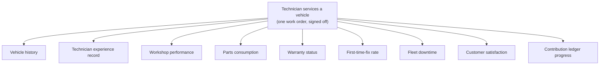

# Shared Services Architecture — the embedded HAMAL layer

**Status:** `PROPOSAL`
**Parent:** [`MOBILITY-VENTURE-FOUNDRY.md`](../../MOBILITY-VENTURE-FOUNDRY.md) §6
**Related:** [`DATA-RIGHTS-POLICY.md`](./DATA-RIGHTS-POLICY.md), [`HAMAL-AGENT-SKILL-ARCHITECTURE.md`](../../Mauritania_Mobility_Intelligence_Canonical_Package/docs/06-agents/HAMAL-AGENT-SKILL-ARCHITECTURE.md)

---

## The problem this solves

Twenty ventures each building their own CRM, parts catalogue, credential check, work-order system, and evidence discipline is twenty times the cost and zero times the compounding. Worse, it guarantees that no venture can prove its quality to an OEM, an insurer, or an institutional fleet, because nobody's records are comparable.

The foundry's answer: **every venture starts on shared rails.** Not because it is forced to, but because the rails are better than what it could build, and because leaving with your data is always possible (`DATA-RIGHTS-POLICY.md` §4).

HAMAL is the common intelligence infrastructure underneath the ventures. HAMAL represents Hanzo, Art Mob AGInts, and Lux.

---

## Service catalogue

Services are grouped in four tiers by dependency and risk. A venture subscribes to tiers, not to individual services, because partial adoption produces incomparable records.

### Tier 0 — Foundation (mandatory for any foundry venture)

| Service | What it provides |
|---|---|
| Identity and permissions | Person identity, role, scope, and audit of who did what |
| Company workspace | Tenant boundary, entity record, lane assignment, jurisdiction |
| Evidence and claims | The claims register, classification, precedence test, conflict flags |
| Consent registry | Every data subject's consent state, scope, language, and revocation |
| Audit history | Immutable record of decisions, approvals, and changes |

Tier 0 is mandatory because it is what makes every other record trustworthy. A venture that will not run Tier 0 is not a foundry venture; it may still be a customer or partner.

### Tier 1 — Operations

| Service | What it provides |
|---|---|
| Customer CRM | Customer records, contacts, consent, history — **owned by the venture** |
| Work orders | Intake, job, parts used, labour, photo evidence, handover, sign-off |
| Vehicle and VIN records | Vehicle identity, specification, ownership chain, service history |
| Service history | Per-vehicle, per-customer, portable to the vehicle owner |
| Technician credentials | Verified credential state, assessor, date, scope of practice |
| Training records | Curriculum progress, assessments, instructor, cohort |

### Tier 2 — Commercial

| Service | What it provides |
|---|---|
| Supplier records | Supplier identity, authority assessment, terms, performance |
| Parts catalogue | Part identity, cross-reference, availability, pricing, lead time |
| Pricing and landed cost | The landed-cost engine, evidence-gated (no price from an `ASSUMPTION`) |
| Procurement pooling | Aggregated demand across ventures for tooling, parts, equipment |
| Quality metrics | First-time-fix, rework, cycle time, warranty claim quality |
| Fleet uptime | Fleet customer downtime, availability, maintenance compliance |

### Tier 3 — Capital and governance (gated by constitution §3.10)

| Service | What it provides |
|---|---|
| Payments and settlement | **Not active.** Requires entity, custody, contract, refund policy, risk allocation |
| Financing records | Asset finance, workshop finance, driver-to-owner schedules |
| Contribution ledger | The S0–S7 and ownership evidence record |
| Governance register | Decisions, panels, conflicts, gate outcomes |
| Anti-extraction scorecard | The published quarterly corridor scorecard |

**Tier 3 payment services do not exist and must not be represented as existing.** No deposits, no customer payments, no participant fees until Section 3.10 preconditions are met.

---

## The compounding event

The architecture's value is that one real-world event writes once and updates many derived views:

Three design consequences follow:

1. **Capture quality at the point of work is everything.** If the work order is incomplete, nine derived records are wrong. This is why work-order discipline is an S1 credential, not an afterthought.
2. **Derived records are never more reliable than their source.** A dashboard number carries the evidence class of its weakest input. The platform displays that class; it does not hide it behind a clean number.
3. **Every derived use needs a consent basis.** The technician consented to a service record. Whether that supports a cross-venture performance benchmark is a separate question, answered in `DATA-RIGHTS-POLICY.md` §3 — not assumed because the data happens to be in the same database.

---

## Tenancy model

| Boundary | Rule |
|---|---|
| **Venture tenant** | Each venture is a tenant. Customer records, pricing, and commercial terms are tenant-private by default. |
| **Cross-tenant reads** | Only via enumerated, consented, auditable mechanisms (§ below). No implicit visibility, including for foundry staff. |
| **Foundry read access** | Limited to: aggregate quality metrics, credential state, gate artifacts, and scorecard inputs. Not customer lists. Not pricing. Not contacts. |
| **Country node** | Country operating companies see their own country's tenants at the enumerated aggregate level, not below it. |
| **Participant record** | Follows the person across tenants; the person controls its export. |
| **Vehicle record** | Follows the vehicle; the current owner controls its export. |

### The four permitted cross-tenant mechanisms

1. **Aggregate benchmarks** — k-anonymous, minimum cohort size, no venture identifiable, opt-out available.
2. **Credential verification** — a venture may verify that a named person holds a claimed credential, with that person's consent.
3. **Parts and procurement pooling** — demand quantities pooled; the requesting venture's customer and pricing data are not exposed.
4. **Vehicle history on transfer** — service history moves with the vehicle on ownership transfer, at the owner's instruction.

Anything not on this list requires a recorded governance decision and the affected subjects' consent. The list is deliberately short and deliberately hard to extend.

---

## Substitutability requirement

Every Tier 1 and Tier 2 service must have a documented answer to: **what does the venture do if the platform is unavailable, or if the venture leaves?**

This is not a disaster-recovery footnote. It is the structural guarantee that the platform earns its position by being good rather than by being inescapable. A venture that cannot leave is not an owner. Each service therefore ships with an export format, an offline or degraded mode where operationally necessary (workshops lose connectivity), and a documented manual fallback.

---

## Agent layer

The shared platform is operated by the skill architecture in [`HAMAL-AGENT-SKILL-ARCHITECTURE.md`](../../Mauritania_Mobility_Intelligence_Canonical_Package/docs/06-agents/HAMAL-AGENT-SKILL-ARCHITECTURE.md). The foundry adds four skills to that roster:

| Skill | Function | Wave |
|---|---|---|
| `founder-ledger-clerk` | Maintains the contribution ledger; refuses unsourced entries; reconciles before any S6 instrument | With Cohort 001 |
| `venture-gate-assembler` | Assembles gate packs, scores artifact completeness, flags unlabelled claims, never votes | With first V1 |
| `cohort-inclusion-monitor` | Tracks coverage gaps by gender, age, geography, disability, and access; publishes them | With Cohort 001 |
| `data-rights-auditor` | Verifies consent basis for every derived use; blocks cross-tenant reads outside the four mechanisms | Before any cross-tenant read |

These follow the same discipline as the existing ten: **every gate they raise is a prompt for a human judgement, not a substitute for one.**

---

## Build sequence

| Wave | Services | Rationale |
|---|---|---|
| **W1** | Tier 0 entire; work orders; technician credentials | Nothing else is trustworthy without these |
| **W2** | Customer CRM; vehicle and VIN; service history; training records | Cohort 001 operating cells need these live |
| **W3** | Parts catalogue; pricing and landed cost; quality metrics | First ventures reach V2/V3 |
| **W4** | Supplier records; procurement pooling; fleet uptime | Supplier round and fleet contracts land |
| **W5** | Contribution ledger; governance register; anti-extraction scorecard | First S6 conversations and first quarterly publication |
| **W6** | Financing records; payments and settlement | Only after constitution §3.10 preconditions are met |

---

*Every service in this document is a `PROPOSAL`. Nothing here should be represented to a participant, venture, customer, or partner as currently operational unless it is.*
