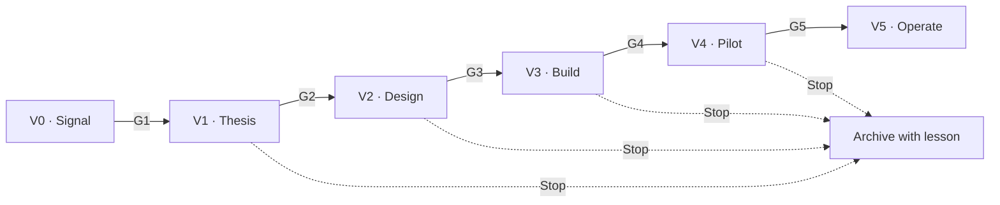

# Venture Stage Gates — V0 to V5

**Status:** `PROPOSAL`
**Parent:** [`MOBILITY-VENTURE-FOUNDRY.md`](../../MOBILITY-VENTURE-FOUNDRY.md) §5
**Machine-readable:** [`data/foundry/venture-stage-gates.csv`](../../data/foundry/venture-stage-gates.csv)

---

## Principle

A gate is not a review meeting. A gate is a **decision with a default of no**, made by a named panel, against evidence that existed before the meeting, with the outcome recorded in the decision register.

Four outcomes only: **Pass**, **Hold** (specified evidence required, dated), **Redirect** (different track, merge, or founder), **Stop**.

"Pass with conditions" is not an outcome. It is how programmes accumulate ventures that never actually cleared anything. Conditions mean Hold.

---

## The pipeline

Every Stop produces an archived record with the lesson, feeding the cohort retrospective. A stopped venture is a cheap lesson; an un-stopped venture is an expensive one.

---

## V0 · Signal

**Question:** is there a real, observed problem here?

**Inputs:** field observation, customer complaint patterns, workshop registry gaps, fleet downtime data, evidence-sprint answers, or a participant's direct experience.

**Artifacts produced:** one-page signal note — the problem as observed, who has it, what they do today, what it costs them, and the source of that claim with its classification.

**Gate G1 → V1 passes only if:**
- The problem is stated as an observation with a source, not as a market-size assertion
- At least three independent instances of the problem are recorded
- The problem is not already solved adequately by an existing corridor venture (checked against the venture registry)
- A named participant wants to own it

**Kills most signals:** the "instances" turn out to be one person's opinion repeated three times.

---

## V1 · Thesis

**Question:** should this business exist, and is this the founder for it?

**Artifacts produced:**
- Venture charter: customer, problem, proposed offer, why the corridor is advantaged here
- Demand evidence pack: named prospective customers, interviews, willingness-to-pay signal separated from stated preference
- Founder record extract: S0–S4 evidence from the lifecycle ledger
- Anti-extraction pre-check: does this venture increase local capability or deepen dependency?
- Lane check: which entity, which country, which risk pool — no lane merging

**Gate G2 → V2 passes only if:**
- Demand evidence includes at least five named prospective customers interviewed, with revealed willingness to pay distinguished from stated preference
- Founder's verified record supports the responsibility level (see `FOUNDER-LIFECYCLE.md` S5)
- The venture fits a catalogued track, or the catalogue is amended by recorded decision
- No claim in the charter rests on an `ASSUMPTION` or `CONFLICT` input without being labelled
- Marine Foundation's lane is not implicated in commercial risk

**Kills most theses:** the founder is ready and the demand is not, or the demand is real and it belongs inside an existing venture rather than a new one.

---

## V2 · Design

**Question:** do the operations and the economics actually work?

**Artifacts produced:**
- Unit economics model with every input labelled by evidence class; no customer-facing price derived from an `ASSUMPTION` or `CONFLICT` input
- Operating design: workflow, staffing, tooling, premises, parts pipeline, supplier dependencies
- Shared-services subscription plan: which HAMAL services, at what cost, with what alternatives if the platform is unavailable
- Data-rights agreement draft: what the venture shares, what it retains, what consent it collects
- Risk register: safety, credit, warranty, currency, supply, regulatory, key-person
- Capital plan: shape, source, and — critically — who carries the loss if it fails

**Gate G3 → V3 passes only if:**
- Unit economics are positive at a defensible price, or the path to positive is stated with the specific assumption being tested at pilot
- Landed-cost, parts, and pricing inputs trace to approved evidence (the customs-broker opinion gates any externally-facing price)
- Data-rights agreement is drafted and reviewed
- Regulatory pathway is identified in-country, not assumed by analogy to another market
- Loss-bearing party is explicitly named and has agreed

**Kills most designs:** the economics only work at a volume nobody has evidence for, or the regulatory pathway was assumed from a neighbouring country's rules.

---

## V3 · Build

**Question:** does the thing exist and function, at small scale, safely?

**Artifacts produced:** operating cell stood up; HAMAL tenant configured; staff hired or seconded and credentialed; tooling and parts secured; SOPs written against the standards library; safety clearance; first work orders executed internally or with friendly customers.

**Gate G4 → V4 passes only if:**
- Safety and quality SOPs are in place and demonstrated, not just written
- Every operator holds the required credential (no unverified staff on live work)
- HAMAL tenant is live and work is actually being logged — not logged retrospectively
- Consent capture is functioning for every data subject touched
- A stop-loss and wind-down plan exists before a single external customer is served

**Kills most builds:** credentialed staffing turns out to be one qualified person and three helpers, or the tenant is configured but the crew is still working off paper.

---

## V4 · Pilot

**Question:** does it hold up with real customers, at real volume, under real pressure?

This is the **canary** stage: a bounded, reversible test in one geography, one fleet, one workshop, one route, one customer segment. Bounded means an explicit stop-loss in money, time, and customer count — set before the pilot starts, not renegotiated during it.

**Measured:** the operating metrics that define corridor quality — first-time-fix rate, rework, cycle time, uptime for fleet customers, warranty claim quality, customer satisfaction, parts availability, margin realised versus modelled, evidence completeness, and safety incidents.

**Gate G5 → V5 passes only if:**
- Metrics meet the published bar over a defined period, not a best week
- Unit economics realised, not modelled, support continuation
- No unresolved safety or governance incident
- Customer records are complete, consented, and owned by the venture
- The founder's operating record through the pilot supports the ownership pathway proposed
- The venture can articulate what it learned that changed the design — a pilot that changed nothing was not a real test

**Kills most pilots:** the metrics work only with the founder personally doing the hard part, which means the business is a job, not a venture. That is a legitimate outcome — it should be redirected to a service cell, not stopped and not scaled.

---

## V5 · Operate

**Question:** is this a governed, durable business?

**Ongoing obligations:**
- Quarterly performance and governance review against the same metric set
- Contribution ledger maintained and reconciled (`OWNERSHIP-AND-EARNED-EQUITY.md`)
- Anti-extraction scorecard contribution, published unconditionally
- Standards compliance and participation in the quality-assurance regime
- Successor development duty (`FOUNDER-LIFECYCLE.md` S7)
- Data-rights compliance audit

A V5 venture may be returned to V4 by governance decision if metrics or governance deteriorate. Operating status is maintained, not granted.

---

## Panel composition

| Gate | Panel |
|---|---|
| G1 | Cohort lead + one operating-cell lead |
| G2 | Country operating lead + venture architect + one external technical assessor |
| G3 | G2 panel + finance/risk reviewer + data-rights reviewer |
| G4 | Country operating lead + quality-assurance lead + safety assessor |
| G5 | Governance body (includes at least one member independent of the venture and of the foundry's commercial interest) |

**No panel may include a person whose economics depend on the outcome of that gate.** Where the corridor is too small to avoid it, the conflict is recorded and an external assessor is added — the conflict is never simply accepted.

---

## Standing rules

1. **Evidence before the meeting.** Artifacts circulate at least 72 hours before a gate. A gate held on a verbal update is void.
2. **Default no.** Absence of evidence is a Hold, not a Pass.
3. **One founder, one venture through V4.** Founders do not run two ventures through a build or pilot simultaneously.
4. **The catalogue is not a menu of approvals.** Listing in `VENTURE-TRACK-CATALOG.md` means the track is recognised, not that a venture in it is approved.
5. **Stops are published.** With the lesson, to the cohort. Silently abandoned ventures teach nobody.
6. **Gates are human.** Agents assemble the pack, score completeness, and flag unlabelled claims. Agents do not vote.

---

*Thresholds and periods in this document are `ASSUMPTION` until Cohort 001 and the first pilots produce observed data.*
